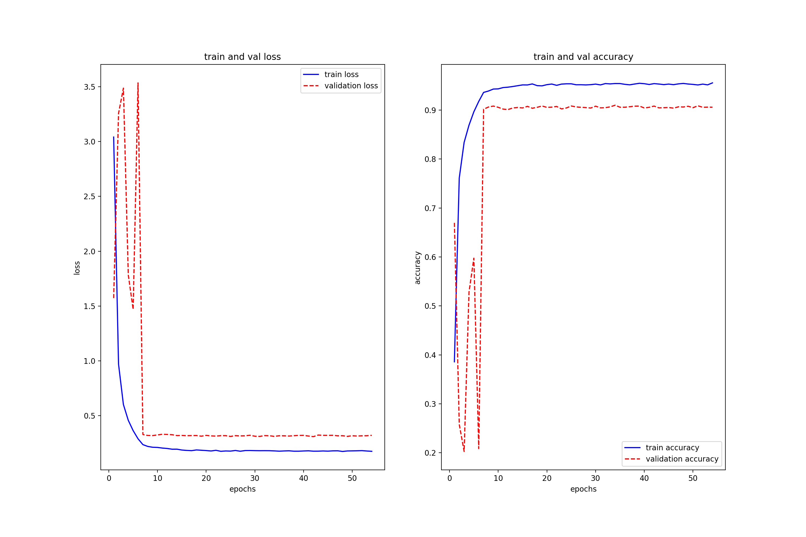
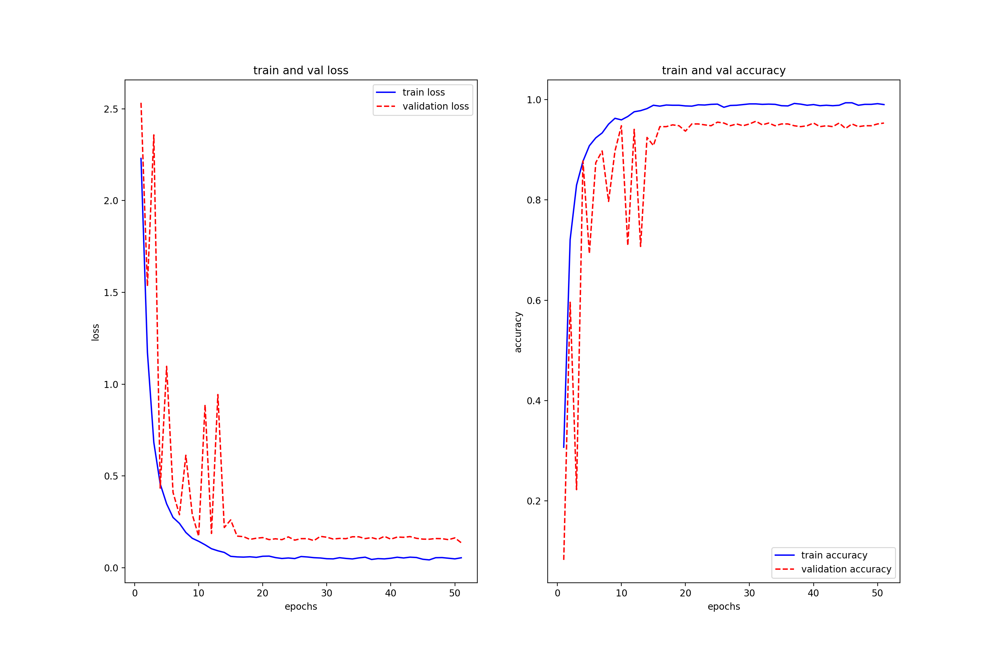
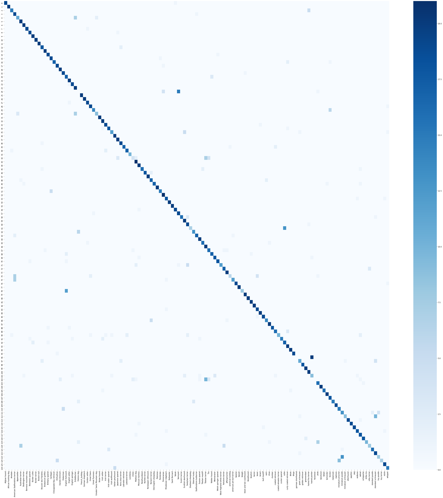
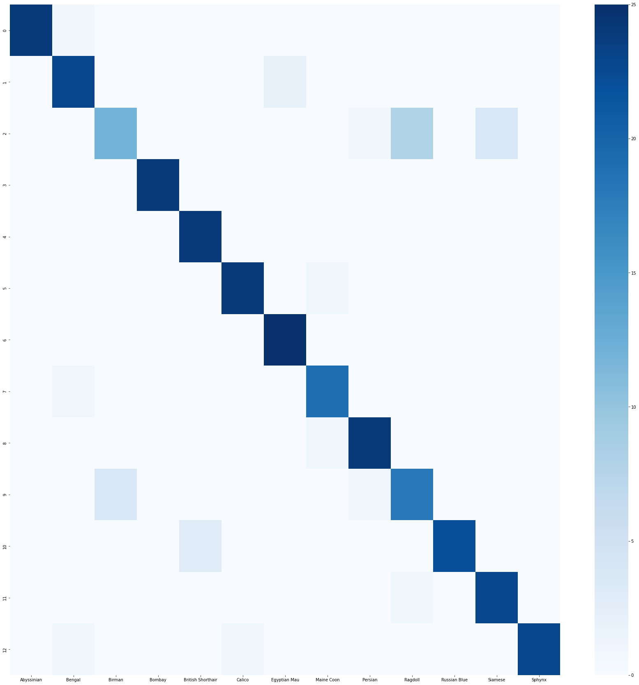

## 궁금하냥?

1. 프로젝트 주제 
- 자신의 반려동물을 분석하여 정보를 얻을 수 있고 커뮤니티를 통해 반려동물 키우는 것에 대해 정보를 공유하는 웹사이트
2. 팀 구성원의 전체 이름과 역할

| 이름 | 역할 |
| ------ | ------ |
| 이정민 | 프론트엔드, 발표 |
| 김애림 | 프론트엔드, 위키작성 |
| 이영민 | 백엔드, 팀장 |
| 이예원 | 백엔드, 위키작성 |
| 홍일도 | 인공지능, 발표 |
| 소범기 | 인공지능, 백엔드 |


### **`서비스 설명`**

##### 1. 기획 의도
- 독거 가구의 증가, 출산률 급감, 반려동물 인구의 증가, 사람들의 외로움을 채워줌
  이러한 현실 상황들로 인하여 반려동물에 대한 정보를 공유할 수 있는 매개체의 필요성이 생김
  '궁금하냥?' 프로젝트를 통해 반려동물 키우는 사람들끼리 정보 공유의 장으로써 원할한 커뮤니케이션 진행
  또한 자신의 반려동물에 대한 자세한 정보를 사진을 통한 종 분석과 백과사전을 통해 확인 할 수 있음

##### 2. 기술스택
- 프론트엔드 (React, React Router, axios, materialUI, styled-components)
- 백엔드 (Node.js, express.js)
- 인공지능 (tensorflow, keras)

##### 3. 웹 서비스의 최종적인 메인 기능과 서브 기능 설명
- 메인 기능
   1. 반려동물 사진을 업로드하여 그 사진을 분석하여 종에 대한 정보를 제공한다
   - 반려동물의 사진을 업로드를 하면, 그 사진을 분석하여 종에 대한 정보를 제공
   - 가장 확률이 높은 품종 3개가 차트로 나오며 가장 높은 확률의 품종에 대한 설명을 조회 가능
   - 사용자들에게 반려동물에 대한 궁금즈을 해결하고 정보를 제공

   2. 반려동물의 산책로 및 병원을 추천한다
   - 사용자 위치를 기반으로 주변에 있는 반려동물 장소 확인 가능
   - 현재 배포된 사이트는 HTTP, HTTPS 이슈로 인해 기본 지정 위치로 첫 화면이 보여짐
   - 반려동물의 산책로, 병원, 카페, 미용실을 검색을 하지않고, 클릭으로 빠르고 쉽게 정보 조회 가능
   - 사용자가 지도에서 찾은 장소를 하트를 눌러 찜목록에 추가 가능
   - 하트를 누른 장소는 사용자의 MY PAGE에서 모아볼 수 있음

   3. 커뮤니티 기능(게시판,좋아요, 댓글기능)
   - 알아둬야 쓸 수 있는 펫 잡학사전
   - 사용자들이 반려동물 관련 지식들을 공유하여, 반려동물에 대한 다양한 정보 확인 및 궁금한 점 해결이 가능함
   - 검색을 하여 원하는 정보를 빠르게 찾을 수 있음
   - 또한 최신순, 하트순, 조회순으로 정렬하여 원하는 정보를 빠르고 쉽게 조회 가능
   
- 서브 기능
   1. 백과사전에서 검색을 통해 종에 대한 자세한 정보를 조회 가능
   - 127종의 강아지와 13종의 고양이에 대한 정보를 제공
   - 사용자들은 다양한 종에 대한 정보를 얻을 수 있으며, 궁금한 점도 해결 가능

   2. 사용자의 mbti를 통해 궁합이 잘맞는 반려동물의 종을 확인 가능
   - 사용자의 mbti를 입력 받아 궁합이 맞는 mbti를 찾고, 궁합이 맞는 mbti를 가진 반려동물 종을 확인

##### 4. 프로젝트 구성
- 와이어프레임 
https://www.figma.com/file/XlIUDZhngBm4CjGvSymuBg/%EA%B6%81%EA%B8%88%ED%95%98%EB%83%A5%3F?node-id=0%3A1


#### 5. AI Model 및 배포
- 사용한 라이브러리 : pandas, sicklt-learn, tensorlow, keras, flask
> 데이터 선정 및 전처리
- Oxford, Stanford에서 제공해주는 이미지 및 구글사진에서 이미지 크롤링을 통해 강이지(26,081) 및 고양이(2,787) 이미지 데이터를 수집
- 이미지의 수를 증가시키기 위해 각각 이미지의 좌우반전을 통해 이미지 증대를 활용
- 분류의 종에 비해 이미지가 작기 때문에, 섬세한 이미지 분류를 위해 기존 이미지 사이즈 200~300 $\times$ 200~300에서 300 $\times$ 300의 전처리를 진행
- Test Set은 각각의 종마다 20개의 구글사진에서 이미지 크롤링을 통해 수집을 진행
- 총 127종의 강아지와 13종의 고양이를 구별하는 두개의 모델을 만들어 제공

> CNN 모델 선정 및 Hyperparameter 선택
- GPU가 없는 VM에 작동을위해 속도를 고려하여 Fine tuning할 모델을 선정
- EfficientNetV2S에서 imagenet weight을 가지고와 사용
   - ref : https://arxiv.org/abs/2104.00298
- 섬세한 분류를 위해 Input layer를 (300,300,3)으로 변경하고, 마지막 layer에 Global average pooling layer, dropout layer(0.5) 및 softmax layer를 추가적으로 연결
- Overfiting 방지 및 효과적인 학습을 위한 reduce learning rate 및 early stopping을 사용
- SGD(momentum=0.5)의 optimizer을 사용하여 initial learning rate = 0.01로 시작하여 $10^{-6}$까지 감소시켰다.

> 모델 훈련 및 평가
- 강아지 모델 훈련 결과

   - `Train set accuracy: 0.9555  ` , `Train set loss: 0.1781` 
   - `Validation set accuarcy: 0.9058` , `Validation set loss: 0.3215`
- 고양이 모델 훈련 결과

   - `Train set accuracy: 0.9901 ` ,  `Train set loss: 0.0541` 
   - `Validation set accuarcy: 0.9953` , `Validation set loss: 0.1359`

- Test Set 평가
- 강아지 모델

```html
Classification Report
                                precision    recall  f1-score   support

                  Afghan hound       1.00      0.95      0.97        20
           African hunting dog       1.00      1.00      1.00        20
                      Airedale       0.88      0.75      0.81        20
American Staffordshire terrier       0.54      0.95      0.69        20
                   Appenzeller       0.79      0.55      0.65        20
            Australian terrier       0.71      1.00      0.83        20
            Bedlington terrier       0.91      1.00      0.95        20
          Bernese mountain dog       1.00      0.95      0.97        20
              Blenheim spaniel       0.90      0.95      0.93        20
                 Border collie       0.91      1.00      0.95        20
                Border terrier       1.00      1.00      1.00        20
                   Boston bull       1.00      1.00      1.00        20
          Bouvier des Flandres       0.82      0.90      0.86        20
             Brabancon griffon       0.95      1.00      0.98        20
              Brittany spaniel       0.90      0.95      0.93        20
                      Cardigan       0.76      0.95      0.84        20
      Chesapeake Bay retriever       1.00      0.85      0.92        20
                     Chihuahua       0.76      0.95      0.84        20
                Dandie Dinmont       0.91      1.00      0.95        20
                      Doberman       0.79      0.95      0.86        20
              English foxhound       0.53      0.85      0.65        20
                English setter       0.87      1.00      0.93        20
              English springer       0.90      0.95      0.93        20
                   EntleBucher       0.59      1.00      0.74        20
                    Eskimo dog       0.00      0.00      0.00        20
                French_bulldog       1.00      1.00      1.00        20
               German shepherd       1.00      1.00      1.00        20
                 Gordon setter       0.90      0.95      0.93        20
                    Great Dane       0.86      0.95      0.90        20
                Great Pyrenees       0.93      0.70      0.80        20
    Greater Swiss Mountain dog       0.82      0.47      0.60        19
                  Ibizan hound       1.00      1.00      1.00        20
                  Irish setter       0.83      1.00      0.91        20
                 Irish terrier       0.86      0.95      0.90        20
           Irish water spaniel       0.86      0.90      0.88        20
               Irish wolfhound       0.86      0.63      0.73        19
             Italian greyhound       0.80      1.00      0.89        20
              Japanese spaniel       0.83      1.00      0.91        20
            Kerry blue terrier       0.83      0.95      0.88        20
            Labrador retriever       1.00      0.85      0.92        20
              Lakeland terrier       0.89      0.85      0.87        20
                      Leonberg       1.00      1.00      1.00        10
                         Lhasa       0.57      0.20      0.30        20
                   Maltese dog       0.78      1.00      0.88        21
              Mexican hairless       0.87      1.00      0.93        20
                  Newfoundland       1.00      0.80      0.89        20
               Norfolk terrier       1.00      0.90      0.95        20
            Norwegian elkhound       1.00      1.00      1.00        20
               Norwich terrier       0.71      0.85      0.77        20
          Old English sheepdog       1.00      0.85      0.92        20
                      Pekinese       1.00      1.00      1.00        20
                      Pembroke       0.93      0.70      0.80        20
                    Pomeranian       0.81      1.00      0.89        21
           Rhodesian ridgeback       0.82      0.90      0.86        20
                    Rottweiler       1.00      1.00      1.00        20
                 Saint Bernard       1.00      1.00      1.00        20
                        Saluki       0.95      0.95      0.95        20
                       Samoyed       0.54      0.95      0.69        20
                Scotch terrier       1.00      0.80      0.89        20
            Scottish deerhound       0.74      1.00      0.85        20
              Sealyham terrier       0.66      0.95      0.78        20
             Shetland sheepdog       1.00      0.35      0.52        20
                Siberian husky       0.81      0.68      0.74        19
     Staffordshire bullterrier       0.94      0.85      0.89        20
                Sussex spaniel       0.87      1.00      0.93        20
               Tibetan mastiff       0.89      0.89      0.89        18
               Tibetan terrier       0.53      1.00      0.69        20
                           Tzu       0.70      0.80      0.74        20
                  Walker hound       0.85      0.85      0.85        20
                    Weimaraner       0.86      0.90      0.88        20
        Welsh springer spaniel       0.95      0.90      0.92        20
   West Highland white terrier       1.00      0.60      0.75        20
             Yorkshire terrier       0.74      0.85      0.79        20
                 affenpinscher       0.91      1.00      0.95        20
              american bulldog       0.86      0.30      0.44        20
     american pit bull terrier       0.92      0.60      0.73        20
                       basenji       1.00      0.95      0.97        20
                        basset       1.00      1.00      1.00        20
                        beagle       1.00      0.40      0.57        20
       black and tan coonhound       0.95      1.00      0.98        20
                    bloodhound       1.00      1.00      1.00        20
                      bluetick       0.95      1.00      0.98        20
                        borzoi       1.00      1.00      1.00        20
                         boxer       0.79      0.95      0.86        20
                        briard       0.95      1.00      0.98        20
                  bull mastiff       0.95      0.95      0.95        20
                         cairn       0.88      0.70      0.78        20
                          chow       0.91      1.00      0.95        20
                       clumber       1.00      0.90      0.95        20
              coated retriever       0.84      0.84      0.84        19
        coated wheaten terrier       1.00      0.50      0.67        20
                cocker spaniel       1.00      0.75      0.86        20
                        collie       0.57      0.85      0.68        20
        curly coated retriever       0.77      1.00      0.87        20
                         dhole       0.95      1.00      0.98        20
                         dingo       1.00      0.95      0.97        20
            german shorthaired       0.00      0.00      0.00        20
               giant schnauzer       0.79      0.55      0.65        20
              golden retriever       1.00      1.00      1.00        18
                   groenendael       0.91      1.00      0.95        20
            haired fox terrier       0.77      1.00      0.87        20
                haired pointer       0.30      0.45      0.36        20
                      havanese       0.00      0.00      0.00        20
                         jindo       0.64      0.94      0.76        17
                      keeshond       1.00      1.00      1.00        20
                        kelpie       1.00      0.89      0.94        18
                      komondor       0.95      1.00      0.98        20
                        kuvasz       0.72      1.00      0.84        18
                      malamute       1.00      0.75      0.86        20
                      malinois       1.00      1.00      1.00        19
            miniature pinscher       0.62      0.75      0.68        20
              miniature poodle       0.48      0.68      0.57        19
           miniature schnauzer       0.90      0.45      0.60        20
                    otterhound       1.00      0.95      0.97        20
                      papillon       1.00      0.95      0.97        20
                           pug       1.00      0.95      0.97        20
                       redbone       0.90      0.90      0.90        20
                        sabsal       0.75      0.90      0.82        20
                    schipperke       0.95      0.90      0.92        20
                     shiba inu       1.00      0.50      0.67        20
                 silky terrier       0.73      0.40      0.52        20
               standard poodle       0.89      0.80      0.84        20
            standard schnauzer       0.56      0.95      0.70        20
                    toy poodle       0.67      0.38      0.48        21
                   toy terrier       1.00      0.33      0.50        21
                        vizsla       0.90      0.95      0.93        20
                       whippet       0.83      0.75      0.79        20

                      accuracy                           0.84      2517
                     macro avg       0.85      0.84      0.83      2517
                  weighted avg       0.85      0.84      0.83      2517

```

   - `Test set accuracy: 0.8411 ` , `Test set loss: 0.5618` 


- 고양이 모델
```html
Classification Report
                   precision    recall  f1-score   support

       Abyssinian       1.00      0.96      0.98        25
           Bengal       0.88      0.92      0.90        25
           Birman       0.75      0.48      0.59        25
           Bombay       1.00      1.00      1.00        24
British Shorthair       0.89      1.00      0.94        24
           Calico       0.96      0.96      0.96        25
     Egyptian Mau       0.93      1.00      0.96        25
       Maine Coon       0.90      0.95      0.93        20
          Persian       0.92      0.96      0.94        25
          Ragdoll       0.67      0.78      0.72        23
     Russian Blue       1.00      0.88      0.94        25
          Siamese       0.85      0.96      0.90        24
           Sphynx       1.00      0.92      0.96        25

         accuracy                           0.90       315
        macro avg       0.90      0.91      0.90       315
     weighted avg       0.91      0.90      0.90       315
```

   - `Test set accuracy: 0.2922` , `Test set loss: 0.9048`

   - 훈련결과의 정확도가 높은것을 알 수 있다.
   - 우리 모델의 문제점 어린 강아지의 종 분류에 있어서 어려움이 생겼다.
   - 믹스견일 경우 부모의 종 발현이 높은쪽의 결과가 나왔다.

> 회고
- 사용하는 VM환경에서 GPU를 사용할 수 없기 떄문에 깊은 레이어의 모델을 사용하지 못해 아쉬웠지만, 개발한 모델의 성능이 괜찮았다.
- GPU 사용시간이 적어, 다양한 fine-grained classification 모델을 적용을 못해 아쉬웠다.

> 모델 서빙을 위한 flask 서버 구축
- post 요청으로 받아온 이미지 전처리 
- 최종 결과 중 상위 3개 항목의 결과값을 전달

